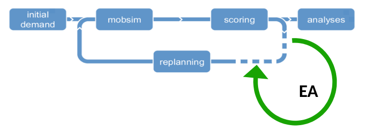
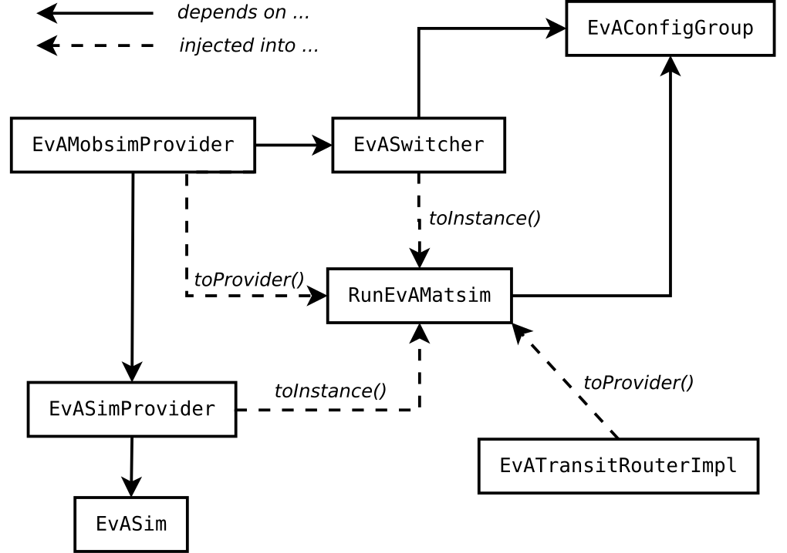

# MATSim-EvA: Merging evolutionary algorithms with MATSim

Planning of the multi-modal transportation system demands complicated matching between spatio-temporally distributed demand and supply subject to numerous spatial and operational constraints. It is a computationally hard optimization problem with the discrete state and decision variables, nonlinear objectives and constraints, and contradictory criteria of optima (Mandl, 1980; Chien & Schonfeld, 1997; Guan et al., 2006; Daganzo, 2010). 

The methods of the PT planning can be divided into two major groups:

- Mathematical programming: simultaneous optimization of three basic dimensions of the PT planning: network design, timetable setting, and vehicles scheduling (Lownes & Machemehl, 2010; Talbi, 2016). Recent literature suggests that mathematical programming reached its limits and a mainstream methodology nowadays is
- Metaheuristics approximate, high-level strategies that "guide" the search process in order to find near-optimal solutions. The domain-specific knowledge defines the heuristic methods that solve a problem quickly but do not guarantee an optimal solution, while the application of these heuristics are controlled by the upper level strategy. (Blum & Roli, 2003; Iliopoulou et al., 2019b)

Metaheuristics in transportation planning and design can be divided into: 

- population-based (evolutionary and swarm intelligence algorithms); 
- based on a single solution (simulating annealing, tabu search); 
- hybrid. 

Auxiliary mathematical programming models are combined with the genetic algorithms in attempts to take the best from different approaches (Duran et al., 2019; Iliopoulou et al., 2019a; Talbi, 2016, 2015). Transit routes outline and frequencies are considered as a solution, while total welfare is an optimization criterion. Typically, the PT planning is considered as a multi-objective optimization problem and a solution is sought in the form of Pareto frontier in the space of users and transport operator costs (Arbex and da Cunha, 2015; Jha et al., 2019; Owais et al., 2016). 

In our preliminary studies, we found that the evolutionary algorithms (EA) that simulate the natural selection of the solutions fit best to the search of localized transportation changes: transportation simulation with the MATSim balances conflicting interests at the level of agents, while an EA pushes the entire system to the global optima. 

The EA approach consists of several steps: 

1. Generate initial population of solutions
2. Evaluate the fitness of each solution and select the fittest one for reproduction
3. Breed new solutions through crossover and mutation
4. Replace the least-fit solutions with the new ones
5. Check termination conditions and start all over again from the step 2, if necessary.

In our study we will apply the cross-entropy (CE) method (Rubinstein & Kroese, 2004; de Boyer et al., 2005) that merges the EA steps into two phases:

1.  According to a stochastic mechanism R\(p\), parameterized by parameters p, generate a random sample of feasible solutions (e.g., modifications of the transportation system).
2.	Update the parameters p of the mechanism R\(p\) based on the generated sample to increase the probability of producing "better" solutions in the next iteration.

An intuition behind the CE method is simple: it improves not a single solution, but the very mechanism of solutions generation. To this aim, CE method selects the best individuals in the sample (that is, the most beneficial modifications of the transportation system) and applies an importance sampling technique to update the generation mechanism R\(p\).

As an example, in context of the transportation planning, a feasible solution may represent a set of possible transit routes through the given roads network. Such solution can be described by a PDF that characterizes the probability that a route consists of specific sequence of stops. 

CE method was successfully used to solve a vehicle routing problem in case of the stochastic demands (Chepuri & Homem-de-Mello, 2005); motion planning for nonlinear robotic systems (Kobilarov, 2011); line planning and scheduling problem for passenger trains (Raviv & Kaspi, 2013). The advantage of the CE method is that its final output is not just a solution, but a mechanism that generates a sample of near-optimal solutions (Rubinstein, 1999).

The crucial element of the EA is an effective representation scheme -- encoding of the solution into an easily manageable data structure. In our case, this scheme will combine decision variables of the different transportation modes, see Appendix for the formal presentation. Note that routing algorithms of the Demand Responsive Transport are a part of the MATSim simulation (Bischoff et al., 2017), and our EA will focus on the optimization of DRT algorithm parameters, like maximal waiting time, increase of the travel time due to ride-sharing, or the maximal distance to the request that will be served.

MATSim is an open source programming environment that offers a considerable customization through its modular design, and in principle, every module of the framework can be modified and exchanged. In this research we will exploit MATSim modularity for merging between the agents adaptation to the existing transportation conditions and the evolutionary algorithms that aim at optimization of these conditions into one co-evolutionary mechanism, in which:

- MATSim mobility simulator is used for the evaluation of candidate solution 
- EA is employed for transportation network re-design inside the MATSim cycle.

The first component of this co-evolutionary mechanism was recently implemented by (Nnene et al., 2019). To implement the second component, we insert a new step of the network modification into the MATSim cycle, locating it between scoring and re-planning steps, when agents adaptation to the current state of the transportation system is already evaluated. Our EA modifies elements of the transportation system predicting the expected changes in the agents scores. The prediction helps in selecting the most efficient modifications. After a "sub-convergence" of the EA search process to a new configuration, the latter will serve as an input for agents re-planning . 

{ width=35% }

We have developed the **MATSim-EvA** (**Ev**olutionary **A**lgorithms) package that will serve as the computational basis for our research. In MATSim-EvA we take advantage of the recently introduced Dependency Injection concept (Zilske & Nagel, 2017). 

{ width=35% }

RunEvAMatsim is an application entry point, joins its components and runs simulation; EvAConfigGroup contains configuration parameters related to EA step; EvATransitRouterImpl is a transit router for modifying transit network during the EA step; EvASwitcher, EvAMobsimProvider, EvASimProvider alternate MATSim/EA steps; EvASim is an entry point for the EA injection.
The EvASim class has an access to the simulation scenario, events manager, network, population, transit lines (routes, schedule, and fleet), and agents plans scoring. The metaheuristic embedded into the EvASim class, will exploit this information during the EA step. 

## Bibliography

Arbex, R. O., & da Cunha, C. B. (2015). Efficient transit network design and frequencies setting multi-objective optimization by alternating objective genetic algorithm. Transportation Research Part B: Methodological, 81, 355–376. https://doi.org/10.1016/j.trb.2015.06.014

Bischoff, J., Maciejewski, M., & Nagel, K. (2017). City-wide shared taxis: A simulation study in Berlin. https://doi.org/10.14279/DEPOSITONCE-7734

Blum, C., & Roli, A. (2003). Metaheuristics in combinatorial optimization: Overview and conceptual comparison. ACM Computing Surveys, 35(3), 268–308. https://doi.org/10.1145/937503.937505

Chepuri, K., & Homem-de-Mello, T. (2005). Solving the Vehicle Routing Problem with Stochastic Demands using the Cross-Entropy Method. Annals of Operations Research, 134(1), 153–181. https://doi.org/10.1007/s10479-005-5729-7

Chien, S., & Schonfeld, P. (1997). Optimization of Grid Transit System in Heterogeneous Urban Environment. Journal of Transportation Engineering, 123(1), 28–35. https://doi.org/10.1061/(ASCE)0733-947X(1997)123:1(28)

Daganzo, C. F. (2010). Structure of competitive transit networks. Transportation Research Part B: Methodological, 44(4), 434–446. https://doi.org/10.1016/j.trb.2009.11.001

de Boer, P.-T., Kroese, D. P., Mannor, S., & Rubinstein, R. Y. (2005). A Tutorial on the Cross-Entropy Method. Annals of Operations Research, 134(1), 19–67. https://doi.org/10.1007/s10479-005-5724-z

Duran, J., Pradenas, L., & Parada, V. (2019). Transit network design with pollution minimization. Public Transport, 11(1), 189–210. https://doi.org/10.1007/s12469-019-00200-5

Guan, J. F., Yang, H., & Wirasinghe, S. C. (2006). Simultaneous optimization of transit line configuration and passenger line assignment. Transportation Research Part B: Methodological, 40(10), 885–902. https://doi.org/10.1016/j.trb.2005.12.003

Iliopoulou, C., Kepaptsoglou, K., & Vlahogianni, E. (2019b). Metaheuristics for the transit route network design problem: A review and comparative analysis. Public Transport. https://doi.org/10.1007/s12469-019-00211-2

Iliopoulou, C., Tassopoulos, I., Kepaptsoglou, K., & Beligiannis, G. (2019a). Electric Transit Route Network Design Problem: Model and Application. Transportation Research Record: Journal of the Transportation Research Board, 2673(8), 264–274. https://doi.org/10.1177/0361198119838513

Jha, S. B., Jha, J. K., & Tiwari, M. K. (2019). A multi-objective meta-heuristic approach for transit network design and frequency setting problem in a bus transit system. Computers & Industrial Engineering, 130, 166–186. https://doi.org/10.1016/j.cie.2019.02.025

Kaspi, M., & Raviv, T. (2013). Service-Oriented Line Planning and Timetabling for Passenger Trains. Transportation Science, 47(3), 295–311. https://doi.org/10.1287/trsc.1120.0424

Kobilarov, M. (2011). Cross-Entropy Randomized Motion Planning. Robotics: Science and Systems VII, 3. https://doi.org/10.15607/rss.2011.vii.022

Lownes, N. E., & Machemehl, R. B. (2010). Exact and heuristic methods for public transit circulator design. Transportation Research Part B: Methodological, 44(2), 309–318. https://doi.org/10.1016/j.trb.2009.07.010

Mandl, C. E. (1980). Evaluation and optimization of urban public transportation networks. European Journal of Operational Research, 5(6), 396–404. https://doi.org/10.1016/0377-2217(80)90126-5

Nnene, O. A., Joubert, J. W., & Zuidgeest, M. H. P. (2019). Transit network design with meta-heuristic algorithms and agent based simulation. IFAC-PapersOnLine, 52(3), 13–18. https://doi.org/10.1016/j.ifacol.2019.06.003

Owais, M., Osman, M. K., & Moussa, G. (2016). Multi-Objective Transit Route Network Design as Set Covering Problem. IEEE Transactions on Intelligent Transportation Systems, 17(3), 670–679. https://doi.org/10.1109/TITS.2015.2480885

Rubinstein, R. Y., & Kroese, D. P. (2004). The Cross-Entropy Method. Springer New York. https://doi.org/10.1007/978-1-4757-4321-0

Rubinstein, R. (1999). The Cross-Entropy Method for Combinatorial and Continuous Optimization. Methodology And Computing In Applied Probability, 1(2), 127–190. https://doi.org/10.1023/A:1010091220143

Talbi, E-G. (2015). Hybrid Metaheuristics for Multi-Objective Optimization. Journal of Algorithms & Computational Technology, 9(1), 41–63. https://doi.org/10.1260/1748-3018.9.1.41

Talbi, El-Ghazali. (2016). Combining metaheuristics with mathematical programming, constraint programming and machine learning. Annals of Operations Research, 240(1), 171–215. https://doi.org/10.1007/s10479-015-2034-y

Zilske, M., & Nagel, K. (2017). Software Architecture for a Transparent and Versatile Traffic Simulation. https://doi.org/10.14279/DEPOSITONCE-8229
